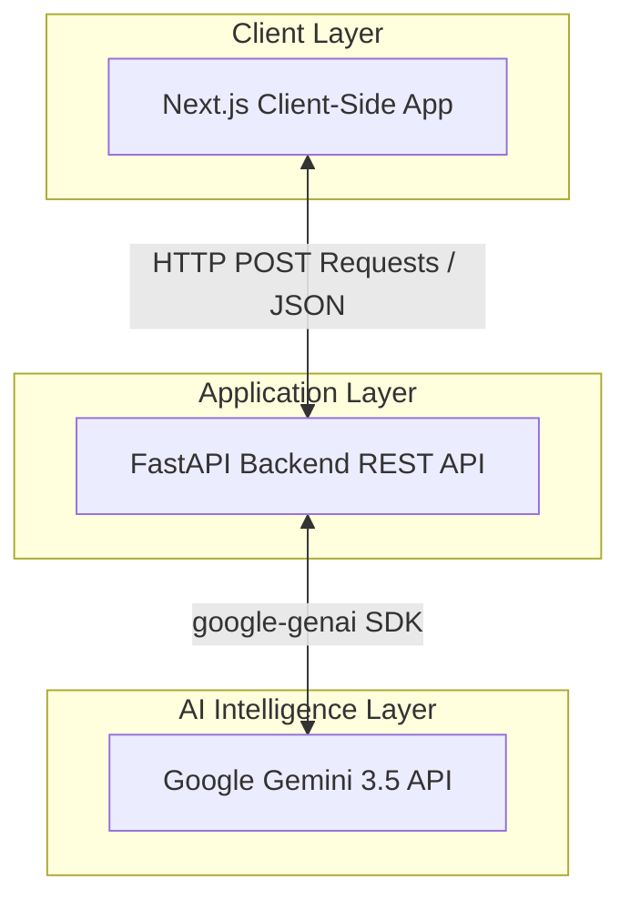
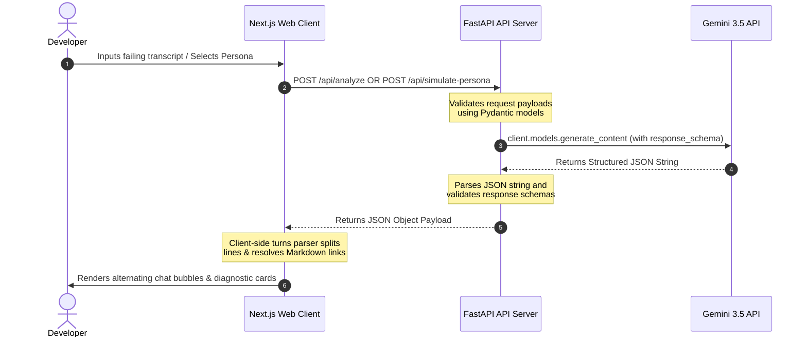
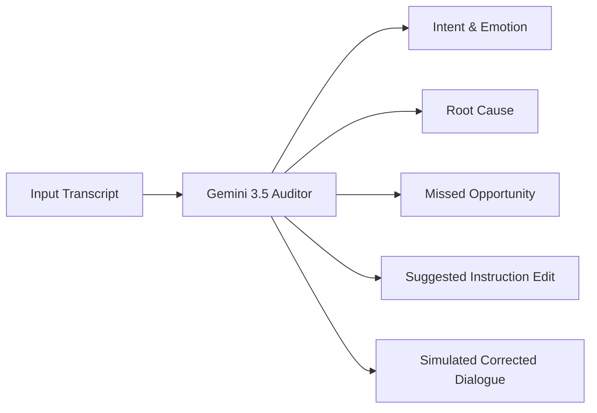
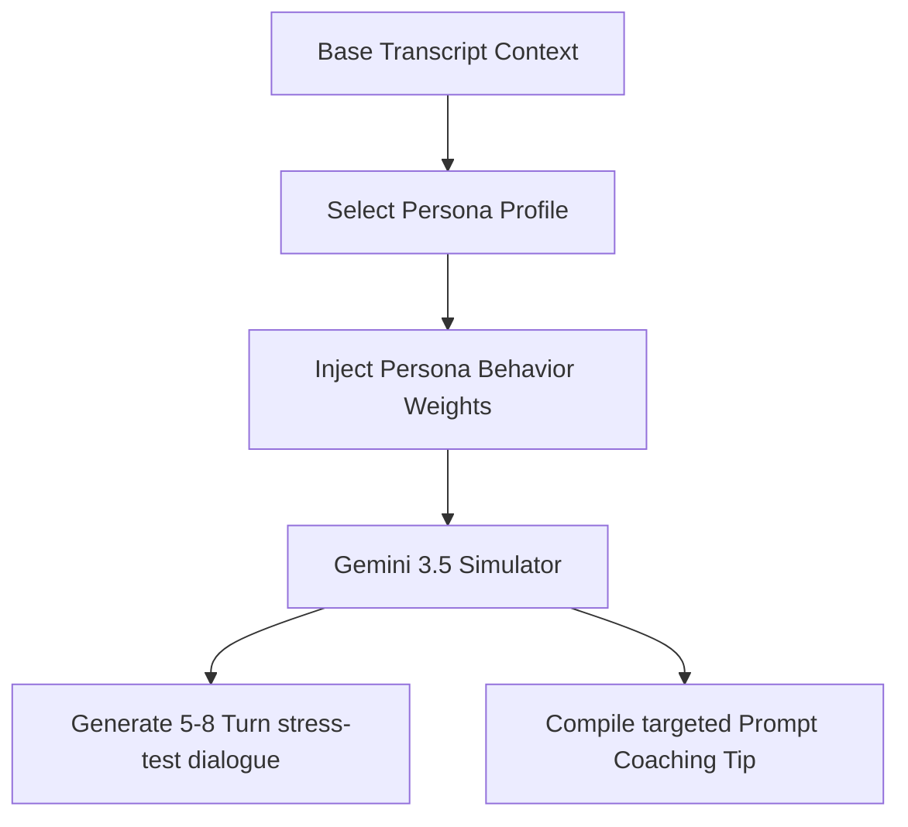

# Conversation Intelligence Studio

An advanced, warm-minimal visual diagnostic sandbox designed to audit, analyze, and stress-test customer-facing AI agents. Powered by Next.js 16, FastAPI, and Google Gemini 3.5.

---

## 📋 Table of Contents
- [Overview](#overview)
- [System Architecture](#system-architecture)
- [Tech Stack](#tech-stack)
- [Project Structure](#project-structure)
- [API Reference](#api-reference)
- [AI Workflow & Prompt Engineering](#ai-workflow--prompt-engineering)
- [Setup Instructions](#setup-instructions)
- [Running Locally](#running-locally)
- [Deployment Guide](#deployment-guide)
- [Future Enhancements](#future-enhancements)
- [Contributing](#contributing)
- [License](#license)
- [Author](#author)

---

## 📖 Overview

As companies increasingly transition customer support operations to LLM-powered conversational agents, maintaining prompt compliance and preventing runtime failures in production is critical. 

In production environments, support bots frequently encounter friction, getting stuck in infinite policy-repetition loops, ignoring handoff instructions to human managers, or drifting from business SLAs. Traditional logging systems help developers track when these errors occur but provide no direct way to debug system prompts or verify updates against edge cases.

To bridge this gap, this project establishes a closed-loop prompt engineering sandbox. Developers paste support transcripts to run an AI-powered diagnostic audit. The sandbox isolates conversational bottlenecks, explains the root cause of failure, and auto-drafts optimized system instructions. To guarantee these instructions hold up in production, developers can immediately stress-test the new prompt configurations by running 5-to-8 turn simulated dialogues against extreme customer personas (Impatient, Budget-Focused, Hostile, and SLA-Auditor) directly inside the UI.

This workflow has been validated with production-ready Next.js 16 and FastAPI services, compiling Next.js assets in the cloud, deploying independent microservices on Vercel and Render, and providing a clean, responsive transcript visualization that parses markdown tracking links into clickable anchors.

---

## 🏗️ System Architecture

### High-Level System Topology


### End-to-End Request Flow


### Conversation Analysis Pipeline


### Customer Persona Simulator Pipeline


---

## 💻 Tech Stack

* **Frontend**: Next.js 16, React 19, TypeScript
* **Styling**: Tailwind CSS v4 (Warm Minimal SaaS design system: Rust `#A1461C`, Cream `#F4EEE3`, Surface Warm-White `#FAF8F4`)
* **Backend**: FastAPI, Python 3.11+, Uvicorn
* **AI Engine**: Google GenAI SDK (`google-genai`), model: `gemini-3.5-flash`

---

## 📁 Project Structure

```
├── backend/
│   ├── main.py              # FastAPI application & Gemini integration
│   ├── requirements.txt     # Python dependencies
│   ├── .env.example         # Template for python environment variables
│   └── .venv/               # Virtual environment directory
├── src/
│   ├── app/
│   │   ├── layout.tsx       # Root layout (hydration mismatch suppressions)
│   │   ├── page.tsx         # Main entry dashboard layout
│   │   └── globals.css      # Custom warm-minimal CSS tokens & scrollbars
│   ├── components/
│   │   ├── Navbar.tsx       # Solid text header (no logos)
│   │   ├── Hero.tsx         # Product introduction & layout anchor
│   │   ├── AIConversationAnalyzer.tsx # Sandbox diagnostics panel
│   │   ├── CustomerPersonaSimulator.tsx # Persona simulation selector & output
│   │   ├── ConversationTranscript.tsx # Reusable turn-by-turn chat rendering
│   │   └── Features.tsx     # Capabilities list
│   └── lib/
│       └── transcript-parser.ts # Regex-based transcript parser
├── next.config.ts           # Next.js configurations & dynamic API proxies
├── package.json             # Node dependencies and npm scripts
└── README.md                # Project documentation
```

---

## 🔌 API Reference

### 1. POST `/api/analyze`
Audits support transcripts to isolate intents, emotional states, loops, and prompt instructions.
* **Request Payload**:
  ```json
  {
    "transcript": "string"
  }
  ```
* **Response Payload (Enforced JSON Schema)**:
  ```json
  {
    "summary": "string",
    "customer_intent": "string",
    "customer_emotion": "string",
    "root_cause": "string",
    "missed_opportunity": "string",
    "suggested_improvement": "string",
    "improved_conversation": "string"
  }
  ```

### 2. POST `/api/simulate-persona`
Simulates a conversation turn-by-turn between an AI agent and a target customer archetype.
* **Request Payload**:
  ```json
  {
    "transcript": "string",
    "persona": "string"
  }
  ```
* **Response Payload (Enforced JSON Schema)**:
  ```json
  {
    "persona": "string",
    "behavior_summary": "string",
    "simulated_conversation": "string",
    "coaching_tip": "string"
  }
  ```

---

## 🤖 AI Workflow & Prompt Engineering

The studio enforces structured AI outputs using Pydantic schema validation inside Gemini SDK generation calls. 

1. **System Instruction Enforcements**: Instructs Gemini to evaluate conversations turn-by-turn, focusing on policy loop fatigue, refusal triggers, and lack of escalation.
2. **Pydantic Validation**:
   ```python
   # Enforces exact JSON parameters in Gemini output
   response = client.models.generate_content(
       model="gemini-3.5-flash",
       contents=prompt,
       config=types.GenerateContentConfig(
           response_mime_type="application/json",
           response_schema=AnalysisResult, # Enforced pydantic model
           temperature=0.2
       )
   )
   ```
3. **Alternating Alignment & Active Hyperlinks**: 
   * Transcripts are parsed dynamically on the client by matching speaker headers (e.g. `[Human]:` right-aligned, `[AI Agent]:` left-aligned) in the `<ConversationTranscript />` module.
   * Standard markdown links (e.g. `[Text](URL)`) inside transcripts are automatically parsed into active, clickable `<a>` links.

---

## 🚀 Setup Instructions

### 1. Clone the Repository
```bash
git clone https://github.com/Nataraj-EL/conversation-intelligence-studio.git
cd conversation-intelligence-studio
```

### 2. Environment Variables Configuration

#### Backend Variables
Create a `.env` file in the `backend/` directory:
```env
GEMINI_API_KEY=your_gemini_api_key_here
```

#### Frontend Variables (Optional)
If deploying or running frontend separately, specify:
```env
NEXT_PUBLIC_API_URL=http://127.0.0.1:8000
```
*(If omitted, Next.js dynamically proxies `/api/*` requests to `http://127.0.0.1:8000`)*

---

## 💻 Running Locally

### Start Backend (FastAPI)
```bash
cd backend
python3 -m venv .venv
source .venv/bin/activate
pip install -r requirements.txt
python main.py
```
*Backend runs on `http://127.0.0.1:8000`*

### Start Frontend (Next.js)
Open a new terminal in the repository root:
```bash
npm install
npm run dev
```
*Frontend runs on `http://localhost:3000`*

---

## 🌐 Deployment Guide

### 1. Backend Web Service (Render)
* **Language**: `Python`
* **Root Directory**: `backend`
* **Build Command**: `pip install -r requirements.txt`
* **Start Command**: `uvicorn main:app --host 0.0.0.0 --port $PORT`
* **Environment Variables**: Add `GEMINI_API_KEY`.

### 2. Frontend Web Service (Vercel)
* **Framework Preset**: `Next.js`
* **Root Directory**: `/` (repository root)
* **Environment Variables**: Add `NEXT_PUBLIC_API_URL` pointing to your deployed Render URL (e.g. `https://your-backend.onrender.com`).
* Vercel will automatically run `npm run build` and serve from `.next/`.

---

## 🔮 Future Enhancements

* **Prompt Diff Viewer**: Visually highlight recommended changes against original prompt files.
* **Persistent Test Suites**: Save transcripts in local databases to regression test system prompts.
* **Telemetry Integrations**: Connect directly to logging providers (such as LangSmith or Phoenix) to import production transcripts instantly.

---

## 🤝 Contributing

Contributions are welcome! Please open an issue or submit a pull request with details of your changes.

---

## 📄 License

This project is licensed under the MIT License. See the [LICENSE](LICENSE) file for details.

---

## ✍️ Author

* **Nataraj EL** - [GitHub](https://github.com/Nataraj-EL)
